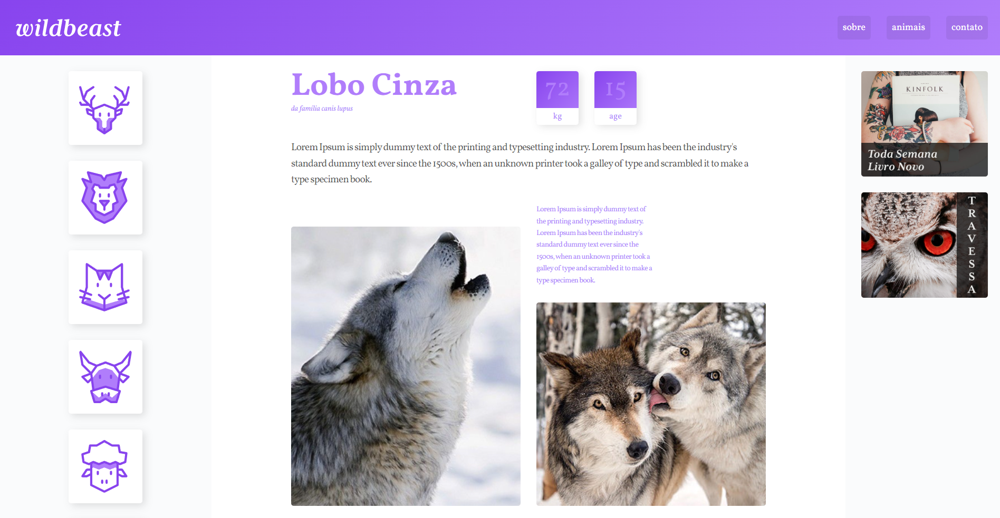
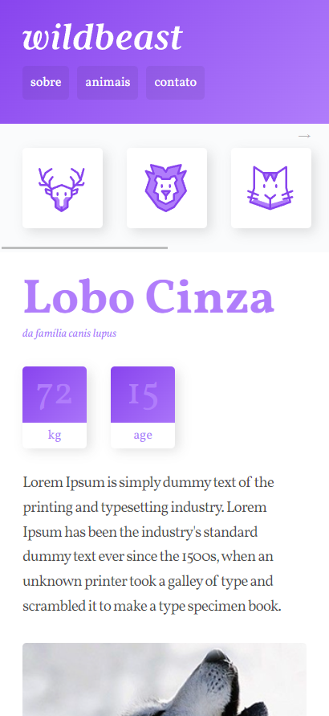

# Projeto wildbeast

Site criado para pratica do CSS-GRID no módulo  CSS Grid Layout da instituição <a style="color:#000;" href="https://www.origamid.com/" target="blank_" title="Ir para site Origamid"><strong>Origamid</strong></a>💜.

## Demonstração
[Link demonstracao](https://ismaelsilvas.github.io/wildbeast/)

## Layout

 - Desktop
 
    

 - Mobile
 

 ## Tecnologias utilizadas
- HTML
- CSS

